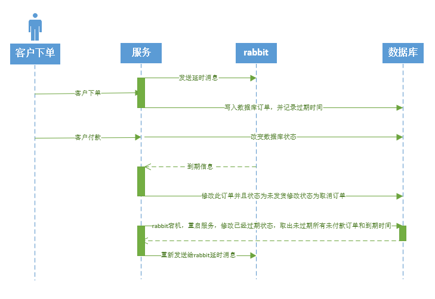

# springboot发送rabbitmq延时消息

## 主要用途

- 订单超过半小时自动取消，不需要定时进询数据库，减轻系统压力；
- 延时消息；
- 一切有定时任务，需要轮询数据库的情况。

### 订单时序图



#### 安装方式

使用docker安装，最主要rabbitmq安装延时消息插件。

#### docker 命令

- 使用dockerfile构建镜像文（制作含有延时消息插件的镜像）

```linux
docker build -t myrabbitmq:3.8 .
```

- 运行容器

```
docker run -d  --name rabbit -p 15672:15672 -p 5672:5672 -e RABBITMQ_DEFAULT_USER=root -e RABBITMQ_DEFAULT_PASS=123456 myrabbitmq:3.8
```


